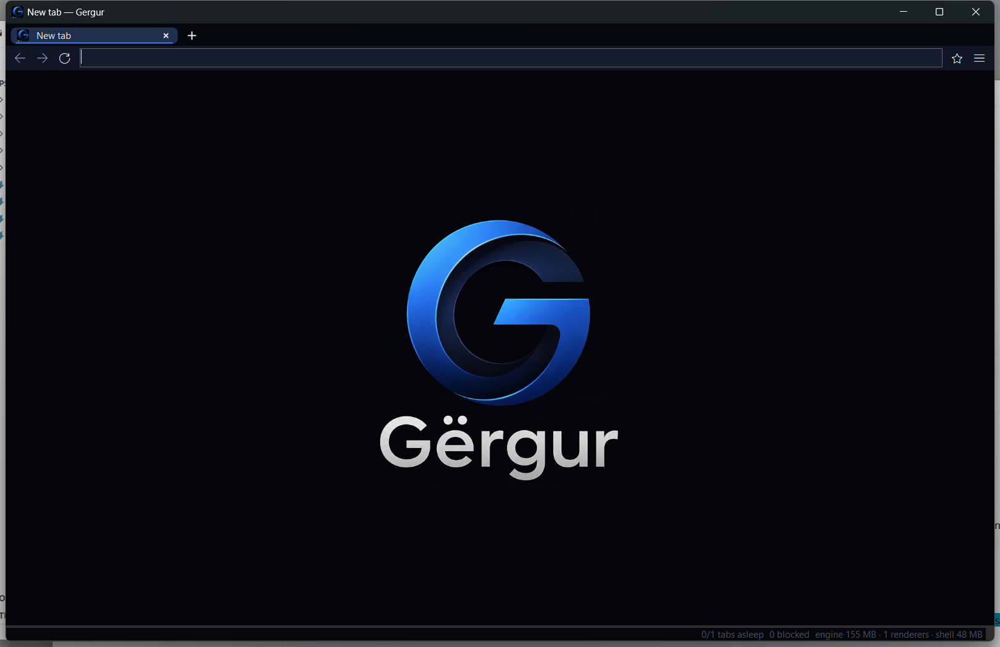
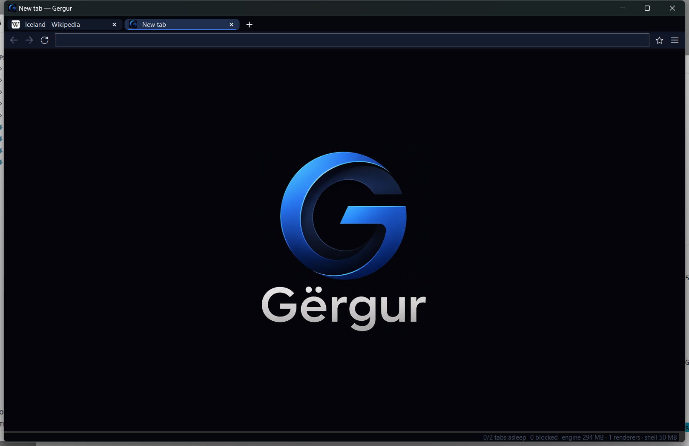

# Gergur

A personal, memory-frugal browser for Windows 11. A tiny WinForms shell over
WebView2 (the Edge engine already installed with Windows - nothing bundled),
with an aggressive tab-lifecycle policy that mainstream browsers won't ship:



## Benchmark

Same six tabs (Wikipedia, GitHub, Hacker News, Stack Overflow, The Verge,
example.com), clean profiles for all three browsers, measured as the sum of
private bytes across each browser's entire process tree:

| | Chrome | Edge | Gergur |
|---|---|---|---|
| All six tabs freshly loaded | 2,835 MB | 1,039 MB | 988 MB |
| A few minutes later | 1,875 MB | 1,031 MB | **374 MB** |

Chrome and Edge keep every renderer alive indefinitely. Gergur converges to a
single live renderer: background tabs first freeze, then park to zero-process
snapshots that reload on click.

## How

- **Active** → the one visible tab, fully alive.
- **Hidden** → background tab, still live.
- **Suspended** (after 3 min idle) → page frozen via `TrySuspendAsync`, renderer
  memory trimmed. Tabs playing audio are exempt (they get low-memory mode instead).
- **Discarded** (after 15 min idle) → the WebView is destroyed entirely; the tab
  keeps only its URL/title/favicon and holds **zero** engine processes until clicked.
  The selected tab is never discarded, so its exact state always survives.

When the window is minimized or the PC is locked for a minute, everything sleeps,
active tab included; restoring the window wakes it instantly. The engine also runs
with the spare-renderer process disabled and memory pressure simulated on hidden
views (`DisableSpareRenderer` / `InactiveMemoryPressure` toggles in settings).

Sleeping tabs show a ☾ in the tab strip. The status bar shows live engine memory,
renderer count, tabs asleep, and blocked-request count. New tabs open the Gërgur
home page (`src/Gergur/Assets/`, generated from the logo, along with the G app icon). Session restore brings
background tabs back as discarded snapshots, so startup cost is one renderer no
matter how many tabs you had open.

Blocking is two layers: the engine's Strict tracking prevention, plus a
hosts-format blocklist (StevenBlack, auto-downloaded on first run) enforced via
`WebResourceRequested` with allocation-free suffix matching on the request hot path.



## Browser-only VPN

`scripts/setup-warp.ps1` provisions a free Cloudflare WARP account (via wgcf)
and a userspace WireGuard tunnel (wireproxy) exposing a local SOCKS5 proxy.
The engine launches with `--proxy-server` plus a host-resolver rule so all
traffic AND DNS route through the tunnel - browser only, nothing system-wide.
Toggle from the menu; a WARP badge shows in the status bar. Verified via
cloudflare.com/cdn-cgi/trace (`warp=on`, Cloudflare exit IP).

## Build & run

```
dotnet run --project src\Gergur          # dev
dotnet publish src\Gergur -c Release     # optimized build
dotnet test                              # unit tests (policy engine, blocklist, URL heuristics)
```

## Shortcuts

| Keys | Action |
|---|---|
| Ctrl+T / Ctrl+W | new / close tab |
| Ctrl+Shift+T | reopen closed tab |
| Ctrl+Tab / Ctrl+Shift+Tab | next / previous tab |
| Ctrl+1..8, Ctrl+9 | tab N, last tab |
| Ctrl+L or Alt+D | focus address bar |
| Ctrl+R / F5, Alt+←/→ | reload, back/forward |
| Ctrl+D | bookmark toggle |
| F12 | DevTools |

## Data & settings

Everything lives in `%LOCALAPPDATA%\Gergur`: `settings.json` (suspend/discard
timers, search engine, browser flags), `blocklist.txt`, `bookmarks.json`,
`history.jsonl`, `session.json`, and the WebView2 profile. The ≡ menu has
"Sleep background tabs now", the browser task manager, and a memory-CSV dump
for A/B-testing flags. Set `GERGUR_DEBUG=1` for a trace log.

Flags in settings (`ProcessPerSite`, `DisableSiteIsolation`, `V8ScavengerMaxMb`)
are applied at engine startup; changing them requires a full app restart.
`DisableSiteIsolation` trades process isolation for fewer processes - off by default.
